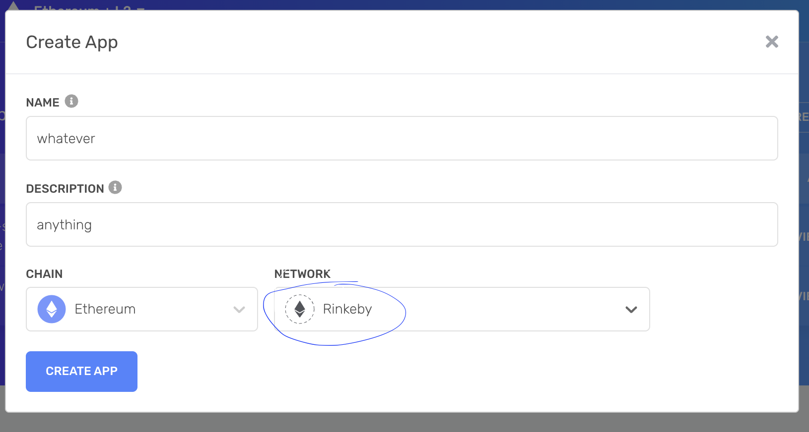

## Setup
- Clone this repo
- yarn install 
- In the root folder, add a .env file and add the variables listed below.  Don't set them equal to anything yet
    - RINKEBY_RPC_URL
    - PRIVATE_KEY
    - ETHERSCAN_API_KEY
- Alchemy (https://www.alchemy.com/)
    - Create an account (or login)
    - Click "CREATE APP" 
    
    - Name and description are not important for this
    - Make sure the Chain is Ethereum and Network is Rinkeby
    
    - Click "CREATE APP" and you should see your app listed
    - Click "VIEW KEY" in far right column and copy the url under HTTPS
    - Paste that url in your .env as your RINKEBY_RPC_URL 
    
    - More on Alchemy...

- MetaMask (https://metamask.io/)
    - Download the Chrome extension
    - Go through their setup process to create a wallet
    
